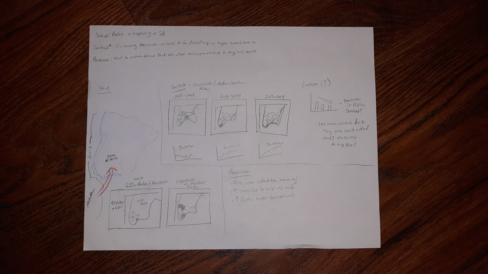

# final_project_CindyVargas

# PART I

# Project Summary
Show the effects of redevelopment on the change in demographics of income earners in the South Bronx neighborhood of New York City. Empahsize the change in proportion of lower income earners as redevelopment has occurred between the years of 2005-2019.

# Potential Story Arc

*Setup*: Redevelopment activities have intensified between the years 2005 and 2019 in the South Bronx.

*Conflcit*: This redevelopment has attracted higher income earners to settle in the South Bronx, pushing out lower income residents.

*Resolution*: Policies that will help retain affordable hosuing can help low income residents stay and benifit from redevelopment.

**User Story**: Major residential and commercial redevelopment of the South Bronx neighborhood has caused higher income earners to move there. The increase in rents correlated with this movement has effectively priced many long-term low-income earning residents out of their homes. As a reader, I want to know if these redevelopment trends are causing the discplacement of long-term low-income earning residents from the South Bronx so that I can take some action to advocate for them.

People care: I spent alot of time in this area and the changes and displacement are really similar to what is occurring in large urban areas acorss the world. Long term residents are being displaced from their homes and there hasn't been much done to help them stay or relocate properly. This could easily be you.

**Call to Action**: Push local policy makers to encourage policies that would either help these residents stay in the South Bronx or help them move to other areas that are affordable.

# Initial Sketches

# Data Sources
I accessed New York City's Open Data site which is a free and publicly accessible website featuring a plethora of data sets from various New York City agencies. I uploaded New York City Permit Data and Census tracts (2010) to use in ArcGIS Pro. I cleaned the permit data significantly to focus on the zip code in which the South Bronx is situated, 10455. Permit data featured address info and points of longitude and latitude, which will be used to plot redevelopment locations in ArcGIS Pro. I  deleted columns that would not add to this project or that had identifying information.

Data related to demographic characteristics and median income were found in the Census Bureau's American FactFinder site. I focused my search on New York's Bronx County and Indivudal Income and Earnings. I found 1-yr ACS data that met my criteria and had information for the years 2005-2017, whuch spans the majority of my time period of interest. I wil post only 2005 and 2017's data files here for convinience. 

1. [Link to Permit Data](https://data.cityofnewyork.us/Housing-Development/DOB-Permit-Issuance/ipu4-2q9a/data)
2. [Link to Census tract Data](https://data.cityofnewyork.us/City-Government/2010-Census-Tracts/fxpq-c8ku)
3. [Link to Income and Demographic Data](Median_Income_2005)
4. [Link to Income and Demographic Data](Median_Income_2017_1yr)

# Method and Medium
I plan to use Esri's Story Maps as the main digital platform to present my final project. Before uploading my project components to Esri's publicly accessible site, I plan to use ArcGIS Pro software to upload all my data sources and visualize the trends and variables of interest. I will focus on five-year time periods to make the visualizations more straight forward. Therefore, the time range of 2005-2019 will be broken up into three intervals; 2005-2009, 2010-2014, and 2015-2019. The most granular data I could find for this analysis is at the Census tract level and thus will use data available at that level.

I am looking to feature resident demographic variables and redevelopment locations on a map for each of these years. For analysis, they will be juxtaposed for analysis. I would symbolize redevelopment locations with small house signs to differenitate them from the individual points indicating residents. South Bronx resident demographic information will start as a point feature class. I hope to highlight changes in the proportion of demographic characteristics, primarily the race of residents, through a graduated color scale, effectively making a choropleth map. This way, viewers can see chaages in resident raciak compostion over these time periods.

To show changes in median income specifically, I will upload median income data to Rawgraphs to create a line graph or bar chart or some other time series visualization and add this to my Story Map. It will be overwhelming to show all the aforementioned variables on a map in ArcGIS so I plan to graph median income for residents in the South Bronx seapraetly to make my visualizations easier to digest. In terms of analytical tools on ArcGIS Pro, I plan to use the Hotspot tool to ultimately create a heat map that will show where changes in resident population and demography were concentrated in the South Bronx and assess whether these changes correlate to redevelopment sites.

I will add text in my Story Map explaining how the South Bronx was historically made up, when redevelopment started in earnest, general trends in the neighborhood and surrounding areas since and information related to what happened to low income residents as well as their demographic makeup. I am thinking of adding more context about what problems residents faced in being able to stay in the South Bronx as revedeopment occurred, such as analyzing  changes in the number of recipeints of Social services in the South Bronx, but that information is difficult to find. I will also include an analysis of my findings and research on potential policy recommendations to help mitigate the consequences related to these changes on low-come earners.

# PART II

**Note Changes to Medium**

I decided to create line graphs for Median Income yearly chages related to Race and Age in Tableau as I found the user interface much more intuitve and more efficient than ArcGIS Pro or RawGraphs. I could not do the comparison of chnages in income and number of redevelopment sites on one map like I originaly sought to do because my data was incompatiable and the demographic data did not contain the necessary fields for me to join those characteristics from Age and Race data to Census tract level data. Furthermore, the demographic data I could find from New York's open source website only contained aggregated data for demographic variables, so I could not meausre individuals and their movement the way I hoped to. I cleaned and synthesized the demographic and median income data into separate excel sheets to make the variables easier to work with within Tableau. As a result, I have 3 maps showing the periodic changes in redevelopment sites throughout the South Bronx based on permit data, in ArcGIS Pro. In Tableau, I created 2 graphs, where one represents yearly median income changes by racial groups and the other age groups.

**Wireframes**

My second round of wireframes were created before my interviews and before I moved onto Tableau. But I was very specific about how I wanted to visualize the median income and demographic data in Tableau after being introduced to it in class. My wireframe sketches will be featured below.
[Link to Second Wireframe](Wireframe_BeforeInterview.jpg)

My third round of wireframes included making changes to my second wireframe based off of feedback I recieved from my interviewees on the ease of interpreting my data visualizations. The changes I made will be detailed in the 'Interviews' section below.
[Link to Third Wireframe](Wireframe_AfterInterview.jpg)

**Interviews**

I chose to interview people who were familiar with the New York City area and were native New Yorkers. I was constrained in getting access to actual local policy makers, who were the originally intended audience, however the nature of how I visualized my data, due to the limitations I came across, may cause me to alter the story I originally wanted to tell as well as the audience that it was intended for, but more on that in a bit.

*Questions*

1. Are you familiar with this area?
2. Do you know what changes have been occurring in the South Bronx?
3. What do you think these dots represents?
4. What aspects of the visuals jump out at you?
5. What aspects of these visuals do you not like? 
6. What suggestions do you have for showing this data differently?

*Interviewees*

1. Native New Yorker- Family

With my GIS maps knew exactly the location I was showing her due to featuring uptown Manhatthan and Central Park. She is aware of the growing gentrifications trends in the South Bronx area. I showed her the GIS maps for redevelopment sites I created and her major critiques were to label the South Bronx neighborhoods that I focus on, bring my study area into more focus with darker outlines for the neighborhoods as well as to make the points that I use to represent the development sites much darker and more apparent. Her critiques on my Tableau graphs focused on her difficulty to interepret what the lines were representing and that mainly had to do with the fact that the accompanying keys were not on the graphs. She suggested pacing the keys on the graphs. However, she was able to interpret my visualiztions well.

2. Native- New Yorker- Spouse

She was also able to quickly deduce that I was showing a map of New York and specifically the Bronx. Her comments on my maps included either making the background lighter to bring out my study area more, though she was able to identify the blue lines that made up my study area relatively quickly. She did say that she would not have been able to interpret the meaning of the dots onthe graph and that I should make a key labeling the dots. Concerning my Tableau graphs, she also had  difficulty interpreting what the lines were reresenting and suggested labeling each line with their own individual label instead of adding a key, especially for the Median Income by Race line graph, where there were many lines and looking back at a key so many times would become tedious

3. Native New Yorker- CMU student

He was able to figure out I was focusing on New York inmy GIS maps due to having lived in Harlem and recognizing the boundaries of the boroughs. He thought my study area could "pop" more by adding either brighter or deeper colors to my dots and area boundaries. His biggest speculation was what I could compare the dots representing redevelopment sites with becuase as a standalone feature he felt that the map was not "telling me much." He saw each map represented a period of  five years, but said that the dots did not seem to move much to really offer significant analysis, though he noted certain neighborhoods expereinced concentraitons of dots compared to others. He felt my Tableau graphs were suitable and when compared with my GIS maps, they did paint a clearer picture of the themes of redevelopment sites and their influence on median income changes but he felt I did not have a strong case for correlation. He also recommeded making a key for the line graphs more apparent to help interpret the lines more effectively.

**Visualizations**

[Link to Visualizations](GIS and Tableau Visualizations.pdf)
